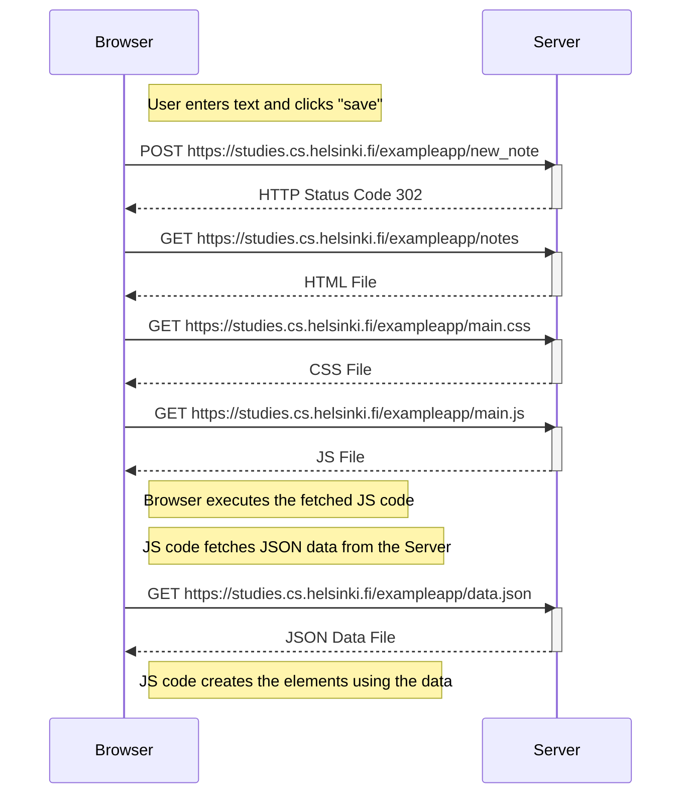

```mermaid
sequenceDiagram

participant Browser
participant Server

Note right of Browser: User enters text and clicks "save"

Browser->>Server: POST https://studies.cs.helsinki.fi/exampleapp/new_note
activate Server
Server-->>Browser: HTTP Status Code 302
deactivate Server

Browser->>Server: GET https://studies.cs.helsinki.fi/exampleapp/notes
activate Server
Server-->>Browser: HTML File
deactivate Server

Browser->>Server: GET https://studies.cs.helsinki.fi/exampleapp/main.css
activate Server
Server-->>Browser: CSS File
deactivate Server

Browser->>Server: GET https://studies.cs.helsinki.fi/exampleapp/main.js
activate Server
Server-->>Browser: JS File
deactivate Server

Note right of Browser: Browser executes the fetched JS code
Note right of Browser: JS code fetches JSON data from the Server

Browser->>Server: GET https://studies.cs.helsinki.fi/exampleapp/data.json
activate Server
Server-->>Browser: JSON Data File
deactivate Server

Note right of Browser: JS code creates the elements using the data
```
