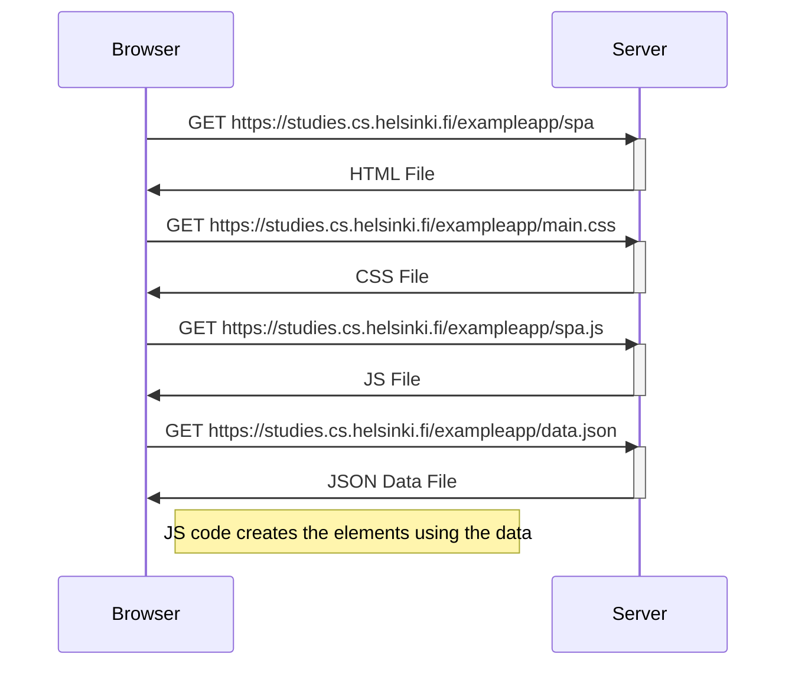

```mermaid
sequenceDiagram

participant Browser
participant Server

Browser->>Server: GET https://studies.cs.helsinki.fi/exampleapp/spa
activate Server
Server->>Browser: HTML File
deactivate Server

Browser->>Server: GET https://studies.cs.helsinki.fi/exampleapp/main.css
activate Server
Server->>Browser: CSS File
deactivate Server

Browser->>Server: GET https://studies.cs.helsinki.fi/exampleapp/spa.js
activate Server
Server->>Browser: JS File
deactivate Server

Browser->>Server: GET https://studies.cs.helsinki.fi/exampleapp/data.json
activate Server
Server->>Browser: JSON Data File
deactivate Server

Note right of Browser: JS code creates the elements using the data
```
